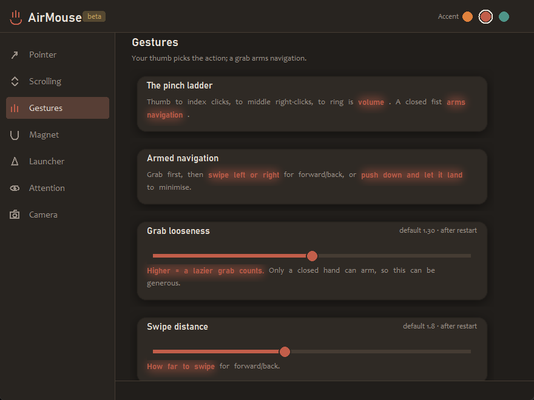
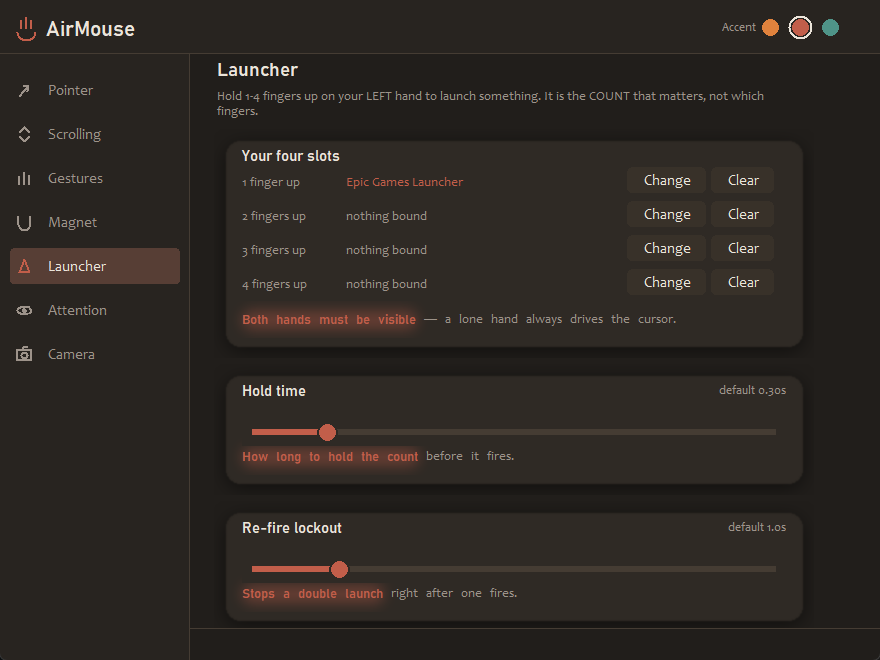

# AirMouse

**Control the Windows mouse with hand gestures through a webcam.**
Right hand drives the cursor, left hand launches apps, and nothing moves
unless you're actually looking at the screen.

> ### Status: beta (v0.9.0)
> Usable day to day, but still in active development — gesture thresholds
> are being tuned against real hands and defaults may move between
> versions. See [Roadmap](#roadmap).

Built with Python, MediaPipe and OpenCV. Windows-only (it drives the cursor
through the Win32 `SendInput` API).



---

## What it does

A webcam watches your hands at 30 fps. One hand moves the pointer, clicks,
scrolls and sets the volume; the other is a four-slot app launcher. A face
model runs alongside to check you're facing the screen, so the cursor stops
when you turn away to talk to someone.

Three ideas shaped the design:

- **Position, not velocity.** Engaging locks an anchor circle sized to your
  hand on camera, so control feels identical whether you're close or far.
  Sensitivity ramps from the centre to the rim: precise in the middle, fast
  at the edge.
- **Nothing fires by accident.** Navigation must be *armed* with a closed
  hand first; an open hand moving quickly is only ever cursor motion. A
  minimise gesture has to decelerate and land before it commits, so dropping
  your arm doesn't minimise a window.
- **Fail safe, not fast.** Tracking dropouts freeze the cursor rather than
  jumping it; held buttons are always released on disengage; a corrupt
  config falls back to defaults instead of crashing.

## Install

Requires Python 3.12 on Windows, and a webcam.

```bash
python -m venv venv
venv\Scripts\python.exe -m pip install -r requirements.txt
```

Run it with **run_airmouse.bat**, or:

```bash
venv\Scripts\python.exe airmouse.py
```

A small always-on-top preview shows what the tracker sees. If it reports the
camera is busy, close whatever else is using the webcam (Discord, Zoom,
Teams, a browser tab) and start it again.

## Gestures — cursor hand

| Gesture | Action |
| --- | --- |
| Flat spread palm ("high five"), hold ~1.2 s | **Engage** — an anchor circle sized to your hand locks in |
| Move hand | **Move cursor** — precise near the centre, faster toward the rim |
| Push past the rim | The circle **follows your hand**, so you can cross the whole screen |
| Thumb + index, tap | **Left click** |
| Thumb + index, held | **Drag** |
| Thumb + middle, tap | **Right click** |
| Thumb + ring, held + move up/down | **Volume** — 1:1, so moving back down undoes it exactly |
| Closed hand (a relaxed grab is enough) | **Arms navigation** — the cursor holds still |
| Grab + swipe left / right | **Forward / Back** |
| Grab + push down, let it land | **Minimise** the active window |
| Peace sign | **Scroll mode** — a zero point locks where the sign formed |
| Peace sign held away from the zero | **Constant scroll** — farther = faster |
| Move back toward the zero | The zero **jumps to your hand**, so reversing is instant |
| Lower your hand | Disengage — the cursor stays where it is |

**Cursor magnetism.** Clickable things get sticky as the pointer nears them,
so a small target like a window's X is easy to stop on. Your hand motion is
scaled down near a target and steered gently toward its centre — but only in
proportion to motion you're already making, so a still hand never drifts, and
sustained movement always pushes straight through. Targets come from window
caption buttons (`WM_NCHITTEST`), classic Win32 controls, and two
accessibility tiers (MSAA and UI Automation) for apps that draw their own UI
— which is what catches the close button on an individual Chrome tab. It's
off during a drag. The preview shows `MAGNET` with a grip bar whenever
something is caught, and **D** adds what the finder can actually see.

Chromium builds its accessibility tree only when something asks for it, so
the finder announces itself the way an assistive tool would and **retries**
until a window genuinely answers. Treating the first ask as sufficient is
the difference between tab buttons working and silently never appearing.

Navigation is armed by finger *count*, not curl depth: a closed hand has no
fingers extended, a peace sign has two, pointing has one. That's what lets a
comfortably loose grab arm the gesture without the scroll pose ever
triggering it. Releasing is deliberately not gated the same way, so a
motion-blurred frame mid-swipe can't disarm you.

## Gestures — launcher hand

Hold up **1–4 fingers** on your other hand for ~0.3 s to launch something.
It's the **count** that matters, not which fingers — two fingers means index
plus middle, and any combination adding to the same count works.

The launcher hand works on its own — raise it by itself and it launches
without ever touching the pointer. That only holds up if the two hands are
told apart reliably, so identity comes from a **sustained vote** over the
last dozen frames rather than a single frame's handedness label: one blurred
frame is confidently wrong often enough to matter. Two properties keep it
honest — the verdict is recomputed from a rolling window every frame, so a
wrong call corrects itself in about a fifth of a second instead of latching
for the session; and until the vote is sure, the hand simply holds no role
at all, so it can't grab the pointer by accident.

While the launcher hand is up alone, the cursor doesn't disengage — it
freezes with its anchor intact, the same as when you glance away from the
screen. Launch something, drop your hand, and carry on pointing without
holding the engage pose again.

The **Left-handed** toggle in Settings mirrors all of this, so the right
hand becomes the launcher and never drives the pointer.

## Settings

Press **B** in the preview window, or run **run_settings.bat**.

Seven sections — Pointer, Scrolling, Gestures, Magnet, Launcher, Attention,
Camera — with every control bound to a real key in `config.json`. Changes
apply immediately where the tracker supports it, and controls that only take
effect at startup say so rather than pretending.



Binding a launcher slot offers four routes: a searchable list of your
installed apps (read from the Start Menu), curated shortcuts that launch
more reliably by URI than by executable (`steam://open/games` opens your
library even when Steam is already running in the tray), the apps currently
running, or drag a shortcut straight onto a slot.

## Attention gate

The mouse only moves while you're facing the screen. Head yaw and pitch come
from a face-landmark model; no face in frame also counts as away.

It's deliberately forgiving — glancing at the edge of a monitor still counts
as looking. Only a clear turn away (about 35° yaw or 25° pitch past your
calibrated neutral, held for ~0.6 s) pauses control, with a dead-band so it
can't flicker at the boundary. A held drag survives a quick glance away and
is released safely if you stay away.

Press **C** while facing your screen to calibrate your neutral pose, or
**A** to toggle the gate off.

## Keys

| Key | Action |
| --- | ------ |
| Q / Esc | Quit |
| P | Pause / resume mouse control |
| B | Open settings |
| D | Toggle the gesture debug readout |
| C | Calibrate the attention gate's neutral pose |
| A | Toggle the attention gate |
| S | Save a screenshot of the preview |

**D** is worth knowing: it shows every threshold a gesture must pass, live —
your current grab depth, how many fingers are up, and the travel, speed and
armed-share of a swipe against what each needs. Green means satisfied. It
turns "why won't this fire?" into a readable answer.

## Tests

```bash
tests\run_all_tests.bat
```

Eleven suites, all headless — they drive the gesture state machine with
synthetic hand landmarks, so the whole pipeline is testable without a camera
or a mouse. They cover the motion model, every gesture detector, the
attention gate, config merging and atomic writes, the launcher, and the pure
logic behind the settings UI.

## Project layout

| File | Role |
| --- | --- |
| `airmouse.py` | Capture loop, overlay, keyboard handling |
| `gestures.py` | Gesture state machine, motion model, all detectors |
| `hand_tracker.py` / `face_tracker.py` | MediaPipe Tasks wrappers |
| `hand_roles.py` | Decides which hand is the cursor |
| `attention.py` | The "are you looking at the screen?" gate |
| `one_euro.py` | One-Euro filter for landmark smoothing |
| `mouse_input.py` | `SendInput` mouse, X-buttons, media keys |
| `magnet.py` | Target discovery and the sticky-cursor wrapper |
| `launcher.py` / `app_index.py` | Finger-count launcher, installed-app discovery |
| `settings_app.py` | Settings app |
| `settings_store.py` | Config data layer and the control manifest |
| `settings_ui.py` | Animated Canvas widget kit |
| `config_defaults.py` | Single source of truth for defaults |
| `DESIGN.md` | Design notes for the settings UI |

`config.json` is generated on first run and holds your own tuning, so it
isn't tracked by git — delete it to return to the shipped defaults.

## Roadmap

- **Window grabbing** — move a window from anywhere on it, not just the
  title bar.
- **Media control** — skip tracks with the launcher hand.
- Ongoing: tuning gesture thresholds against real-world use.

## Known limitations

- Windows only.
- Needs reasonable light. In a dim room the camera stretches its exposure
  and drops to ~8 fps, so the app forces a short manual exposure to hold
  30 fps — usable, but bright rooms track better.
- Only one app can hold the webcam at a time.
- Magnetism can only see controls an app exposes to Windows. Games and
  some custom-drawn UIs expose nothing, so it quietly does nothing there.
- Gesture thresholds are still being tuned; the **D** readout is there
  precisely because they aren't final.
